# 💱 LiterAlura 

> This is one of the challenges proposed by Alura Latam in the Oracle Next Education program.

This project is a book catalog that allows you to search for books through an API (https://gutendex.com/), store the
results in a database and then query certain information such as a list of books, authors and filter them according to
various options.

## 🚀 Demo

The program displays a menu where the user can select between the options of searching for a book by title or an author
by name, see some lists with database records, filter the data according to some parameters and even be able to see a
ranking of the books with the most downloads.

### Menu

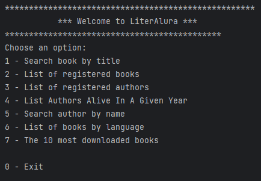

### Example of search a book by title

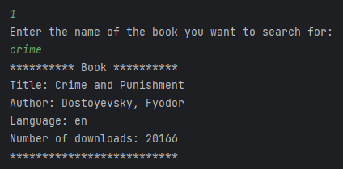

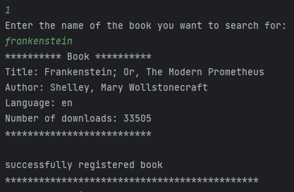

### Example of list of registered books

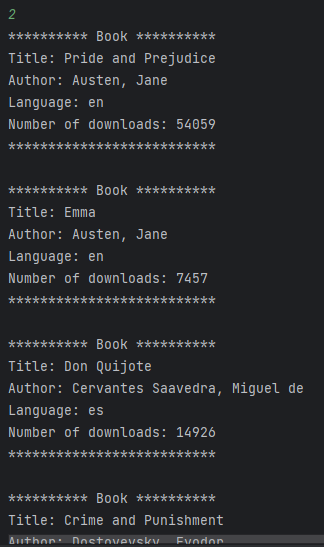

### Example of list of registered authors

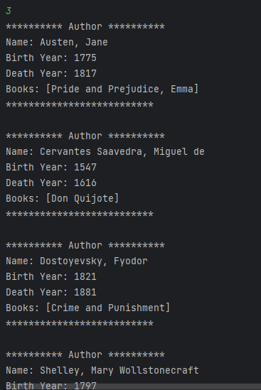

### Example of list of authors alive in a given year

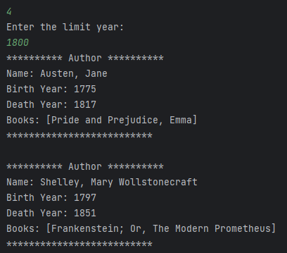

### Example of search author by name

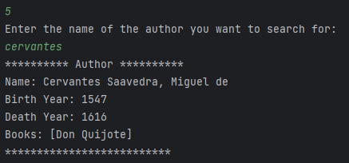

### Example of list of books by language

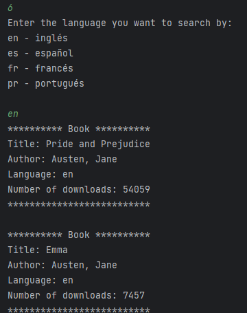

### Example of the 10 most downloaded books

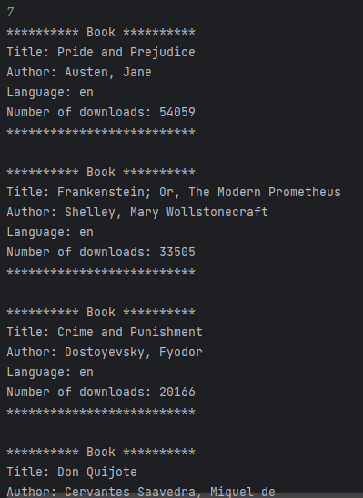

### Example of validations

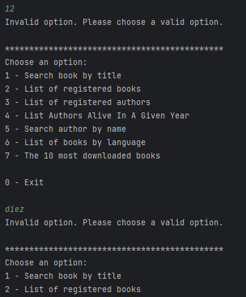

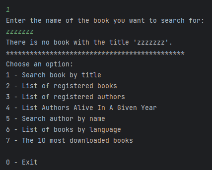

## ⚙️ Project Structure

1. `controller`: Contains the interactive menu, connection to services and a validator
2. `domain`: Entities for our database.
3. `dto`: Filter to send the data from dto not entities.
4. `repository`: Applying Spring Data JPA to make the queries.
5. `service`: All our persistence logics and api consumption.
6. `utils`: Contains the menu and textual interface options.

## 🔧 Installation

Before all, make sure you have Java (JAVA SDK 17) and some IDE (for example IntelliJ IDEA or Eclipse) installed.

#### 1. Initialize the project

- Clone the repository
  ``` bash
  git clone https://github.com/kmartiat/LiterAlura-challenge.git
  ```

#### 2. Create the postgres database on your computer.

#### 3. Open the project in IDE.

This can be done with the IDE of choice (IntelliJ IDEA or another).

#### 4. Define the following environment variables

- DB_HOST your host (localhost for example)
- DB_PORT the port
- DB_NAME database name
- DB_USERNAME postgres username
- DB_PASSWORD postgres password

#### 5. Run LiteraluraApplication class.

## 🛠️ Built With

### Tech Stack

- Java

- Spring Framework

- Spring Data JPA

- Hibernate ORM

- PostgreSQL

## 📝 License

The MIT License (MIT)